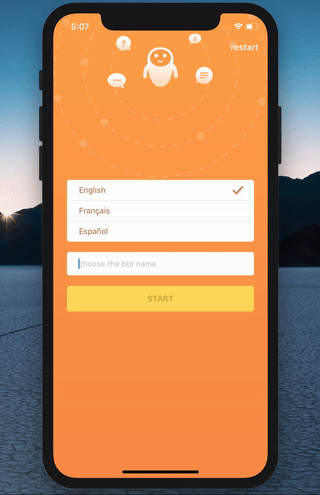

[](https://github.com/RxSwiftCommunity/CombineLocalizer)
[](https://github.com/RxSwiftCommunity/CombineLocalizer/blob/master/LICENSE)

# CombineLocalizer

CombineLocalizer is a framework written in swift which allows you to localize your apps, using Combine. 

<p align="center">

## Requirements

- Xcode 11+
- Swift 5+
- iOS 13+

## Installation

### Swift Package Manager (requires Xcode 11)

Add package into Project settings -> Swift Packages

### CocoaPods

```ruby
pod 'CombineLocalizer'
```

## Usage

### Before all:

```swift
import CombineLocalizer
```

### Reactive localized strings

```swift
Localizer.shared.localized("Start")
  .map { $0 }
  .assign(to: \.text, on: startLabel)
  .store(in: &cancellableBag)
```

### Synchronously localized strings

```swift
startLabel.text = Localizer.shared.localized("Start")
```

### Change language

You are able to set language by language code. 
A full list of the codes you can check [here](https://www.ibabbleon.com/iOS-Language-Codes-ISO-639.html).
```swift
Localizer.shared.changeLanguage.accept("en")
```

### Change CombineLocalizer configuration

You are able to change default configuration, using `changeConfiguration` property.

```swift
let localizerConfig = LocalizerConfig(defaults: .standard, bundle: .main, tableName: "Localizable")
Localizer.shared.changeConfiguration.send(localizerConfig)
```

## License

CombineLocalizer is available under the MIT license. See the LICENSE file for more info.
Copyright (c) Vlad Khambir
